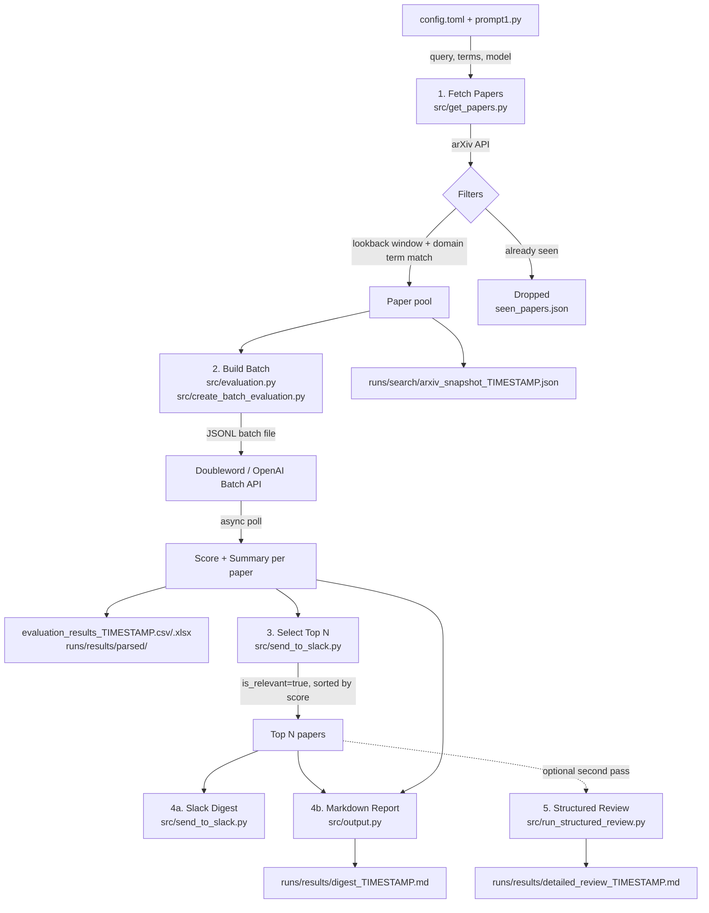

# Architecture

## Overview

`arxiv-daily-digest` is a daily pipeline that fetches recent arXiv papers, scores them for relevance using an LLM, and delivers the top results as a Slack digest and markdown report. It is designed for the IFoA General Insurance ML in Reserving Working Party.

## End-to-End Flow

## Key Components

| File | Role |
|------|------|
| `src/main.py` | Orchestrates the full pipeline |
| `src/get_papers.py` | arXiv API fetch, date/term filtering, dedup via `seen_papers.json` |
| `src/evaluation.py` | LLM prompt + structured output schema (`relevance_score`, `summary`, `key_insight`) |
| `src/create_batch_evaluation.py` | Submits batch, polls for completion, parses results |
| `src/send_to_slack.py` | Filters to relevant papers, ranks by score, posts to Slack |
| `src/output.py` | Writes markdown digest and arXiv search snapshot JSON |
| `src/run_structured_review.py` | Optional standalone second-pass review of digest papers |
| `src/config_loader.py` | Loads `config.toml`; holds defaults for all pipeline settings |
| `prompt1.py` | Team interest profile used to personalise LLM scoring |

## Scoring

Each paper is scored 0–10 by the LLM against the team's interest profile. Papers scoring ≥ 7 are marked relevant. The top `N` relevant papers (default 10) are delivered to Slack and the digest.

## Outputs

| File | Description |
|------|-------------|
| `runs/results/digest_TIMESTAMP.md` | Human-readable ranked digest of top N papers |
| `runs/results/parsed/evaluation_results_TIMESTAMP.csv/.xlsx` | Full scored paper set — all papers with `relevance_score`, `summary`, `key_insight`; Excel-ready for manual review |
| `runs/search/arxiv_snapshot_TIMESTAMP.json` | Full arXiv search trace for auditing and re-runs |
| `runs/results/detailed_review_TIMESTAMP.md` | Optional structured deep-dive (second pass) |
| `pipeline_data/seen_papers.json` | Dedup registry; prevents re-sending the same paper |
